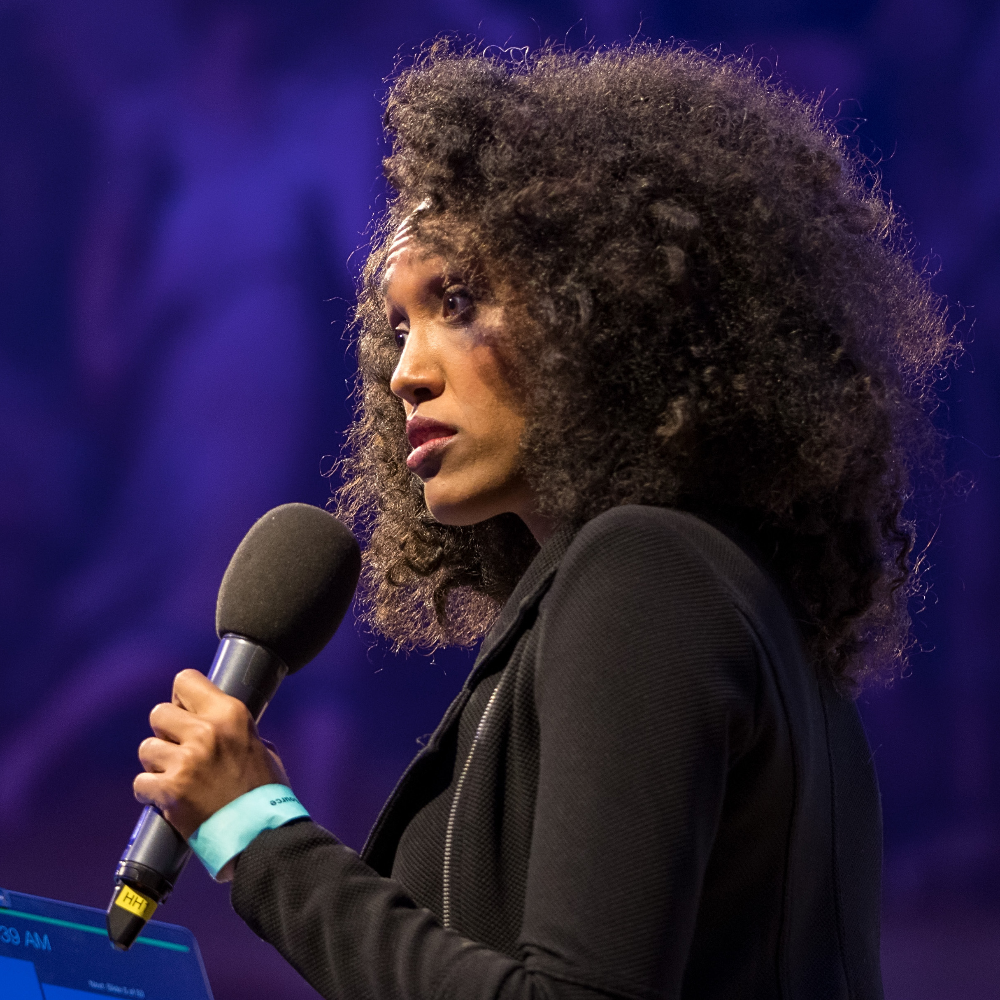

Location: Anywhere in the world

August 17-18, 2020

Sponsored by Google, USA

 

Organizers:

[Emerson Murphy-Hill](https://ai.google/research/people/EmersonMurphyHill),  Google 

[Margaret-Anne Storey](http://margaretstorey.com/),  University of Victoria   

[Denae Ford](http://denaeford.me/), Microsoft Research

[Sophie Qiu](http://www.sophiehsqq.com/), Carnegie Mellon University

This workshop is organized to raise awareness about developer diversity and inclusion challenges faced by industry today. Our intent is to understand these challenges more clearly, to brainstorm concrete goals to address them, and to gather recommendations and best practices to share with practitioners.  We also aim to build a community of researchers and practitioners that share a passion to improve software developer diversity and inclusion.  

Below, you may find details on the schedule and attendance.  Stay tuned for more details of the workshop outcomes! 

[Here is the link to last year's workshop](http://margaretstorey.com/sddi/)

 

### Keynote speakers

**Biao Xiang**

 **Diversity and Heterogeneity** The looming threat of another Cold War reminds us how easily the world can become divided — again. Differences were never truly eradicated by multiculturalism or globalization, no matter how much it was presumed they would. In this talk I wish to probe two ways of how differences are organised and presented: one is the mode of diversity, the other heterogeneity. 

Diversity means varied styles, while heterogeneity means different natures. Diversity can be found in places like universities, the headquarters of the United Nations, the offices of Google, and international art festivals. In these places, people are visibly different, lead explicitly different lifestyles, and celebrate their differences, even if they may talk, think and act in similar ways. Meanwhile, we encounter heterogeneities in the peripheries of Calcutta, Johannesburg, or São Paulo, and in border towns in Southeast Asia and the Middle East. Social activities of different natures entangle with each other: formal, and informal; legal, and illegal; licit, and illicit. 

Diversity and heterogeneity are not mutually exclusive. There are abundant heterogeneities in places of diversity. Hierarchy in status is an important dimension of heterogeneity, for instance the divide between citizens, legal and illegal migrants, as well as between permanent staff, temporary workers and interns. Heterogeneities are the basis of how profits are made, and power sustained. But heterogeneities are not always critically scrutinized, and are sometimes masked as concerns about diversity. The growing app-based platform economy has multiplied heterogeneities—in labour relations, social status, and ideological positions.

**Biao Xiang** 项飙 is a Professor of Social Anthropology at the University of Oxford, and Director of Max Planck Institute for Social Anthropology in Germany. Xiang’s research addresses various types of migration – internal and international, unskilled and highly skilled, emigration and return migration, and the places and people left behind – in China, India and other parts of Asia. Xiang is the winner of the 2008 Anthony Leeds Prize for his book Global Bodyshopping and the 2012 William L. Holland Prize for his article ‘Predatory Princes’. His 2000 Chinese book 跨越边界的社区 (published in English as Transcending Boundaries, 2005) was reprinted in 2018 as a contemporary classic. His work has been translated into Japanese, French, Korean, Spanish and Italian.

 

**Saron Yitbarek**

**What I learned from 6 years of building CodeNewbie** Saron shares the story of how she started her community-turned-company, CodeNewbie, the lessons learned along the way as an entrepreneur, a community manager, and a developer, and the impact of the acquisition on the future of the community.

**Saron Yitbarek** is the founder of Disco, a platform for audio courses on technical topics. She's also the founder of [CodeNewbie](https://www.codenewbie.org/) (acquired), a podcaster, speaker, and developer.

 

### Talks and Slides

| Speaker Name         | Talk Title                                                                                                     |           |                                                                                                                     |
|----------------------|----------------------------------------------------------------------------------------------------------------|---------------------------------------------|-----------------------------------------------------------------------------------------------------------------------------------|
| Alexander Serebrenik | Is 40 the new 60? How popular media portrays the employability of older software developers                    | [Video](https://youtu.be/a7tt18Gh8M0)                | [Slides](https://www.slideshare.net/aserebrenik/is-40-the-new-60-how-popular-media-portrays-the-employability-of-older-software-developers) |
| Ayushi Rastogi       | A Theory of Software Change                                                                                    | [Video](https://youtu.be/3-ZuquyzZKU)                | [Slides](https://docs.google.com/spreadsheets/d/1Xg1fIJfKXZtNAvkfZOJnpy-GEf7UqlyLTyyHkHn6MZc/edit?usp=sharing)                              |
| Ita Richardson       | How can we include the EU Accessibility Directive in  our  on-line teaching materials?                         | [Video](https://youtu.be/fyiwwLBA9Gc)                | [Slides](https://drive.google.com/file/d/18nMlqTfsdWKfUMqt_emZ41ZAMjPanHb2/view?usp=sharing)                                                |
| Dominique Wimmer     | Equity Engineering: Impact & Opportunity                                                                       | [Video](https://youtu.be/t2Pibvq2w44)                | [Slides](https://docs.google.com/presentation/d/1eoXAjBpJ8eO0KTNSNe7IW2pMMRlD6X0GYw8qM76FNZU/edit)                                          |
| Stephanie Ludi       | Empathy, Opportunity and Inclusion in Accessible Design: a perspective from undergraduate CS education         | [Video](https://youtu.be/-AKdFN5_1LY)                | [Slides](https://drive.google.com/file/d/1t5XjcvLTkNHQWscAiNLzQGhf9yOSb4Nq/view?usp=sharing)                                                |
| Carolyn Egelman      | Predicting Developers’ Negative Feelings about Code Review                                                     | [Video](https://youtu.be/R24SMhf1P0Y)                |                                                                                                                                   |
| Yu Huang             | Investigaing Bias in Code Review using Medical Imaging and Eye-Tracking (and A Summay of Diversity Work at UM) | [Video](https://youtu.be/z8oQD_o2JL8)                | [Slides](https://drive.google.com/file/d/1iBO5VJnDebJRsx-xJ8Zgh4nVR9TcRPi7/view?usp=sharing)                                                |
| Andrew Begel         | Experiences Running a D&I Program at ASE 2019                                                                  | [Video](https://youtu.be/bbY1ocm3Qlw)                | [Slides](https://www.slideshare.net/secret/d0NPjPxqKT8EWn)                                                                                  |
| Denae Ford           | Conducting Covert x Overt Inclusion Research                                                                   | [Video](https://youtu.be/AzwaP1hdnec)                | [Slides](https://www.slideshare.net/secret/FrNjlrIhi1LTD5)                                                                                  |
| Rafael Prikladnicki  | Agile Inclusive Accelerator: a research and education program for an equitable tech future                     | [Video](https://www.youtube.com/watch?v=2fayFh8pIko) | [Slides](https://docs.google.com/presentation/d/1D2WOVC5iZmPyDZZw_sqCblPGDWXWJPxxCtT6KpOFXLI/edit?usp=sharing)                              |
| Anita Sarma          | Hidden Figures: Different Roles and Success Pathways in Open Source                                            | [Video](https://youtu.be/1kz4UClLQSg)                | [Slides](https://docs.google.com/presentation/d/1i59ZIncSiaEw29-sN3t5V0VeYbgkOgMjd82EGzizAFM/edit?usp=sharing)                              |

### Registration, Attendance, and Schedule

* Please [register here](https://docs.google.com/forms/d/e/1FAIpQLSfwWOUEMWLhe1lHTGzKjVpgWFxukMXYGyxD9jhGJDJxv7iYAA/viewform). It's free!
* [Join our Slack channel here](https://join.slack.com/t/sddi-2020/shared_invite/zt-gsmbkapc-RWha4nJRMCgvrIbyxhY5Fg)
* Join the meeting at https://meet.google.com/fdn-kdif-ksa
* See the calendar below for a schedule of events in *Pacific Daylight Time (PDT) / UTC -7h*
* To see events in your local time zone, [open the calendar here](https://calendar.google.com/calendar/b/0?cid=Y18yaGNsdjc4bjQwcWJtMDlxMGN2ajFrdG4yMEBncm91cC5jYWxlbmRhci5nb29nbGUuY29t).
* On August 17th, we'll have a variety of talks on the topic. On August 18th, we'll have breakout sessions, scheduled just-in-time.

<iframe src="https://calendar.google.com/calendar/embed?height=600&amp;wkst=1&amp;bgcolor=%23ffffff&amp;ctz=America%2FLos_Angeles&amp;src=Y18yaGNsdjc4bjQwcWJtMDlxMGN2ajFrdG4yMEBncm91cC5jYWxlbmRhci5nb29nbGUuY29t&amp;color=%23C0CA33&amp;mode=AGENDA&amp;title=SDDI%202020&amp;showDate=0&amp;showTz=0" style="border-width:0" width="800" height="600" frameborder="0" scrolling="no"></iframe>

### Attendees

| Name                      | Affiliation                                               |
|---------------------------|-----------------------------------------------------------|
| Akond Rahman              | Tennessee Tech University                                 |
| Alannah Oleson            | University of Washington                                  |
| Alexander Serebrenik      | Eindhoven University of Technology                        |
| Alexandra Bugariu         | ETH Zurich, Switzerland                                   |
| Amber Horvath             | Carnegie Mellon University                                |
| Amiangshu Bosu            | Wayne State University                                    |
| Amin Alipour              | University of Houston                                     |
| Andrew Begel              | Microsoft Research                                        |
| Anielle Severo Lisboa     | Pontifical Catholic University of Rio Grande do Sul       |
| Anita Sarma               | Oregon State University                                   |
| Ann Barcomb               | University of Calgary                                     |
| Ash Kumar                 | Google                                           |
| Ayushi Rastogi            | TU Delft                                        |
| Biao Xiang	| University of Oxford and Max Planck Institute |
| Bianca Trinkenreich       | Northern of Arizona University                            |
| Bogdan Vasilescu          | Carnegie Mellon University                                |
| Camila Freitas Sarmento   | Federal University of Campina Grande                      |
| Carolyn Egelman           | Google                                                    |
| Cassandra Cupryk          | University of Victoria                                    |
| Chelsea Adelman           | GitHub                                                    |
| Corrina Burnley           | Google                                                    |
| Damyanka Tsvyatkova       | University of Limerick                                    |
| Denae Ford                | Microsoft Research                                        |
| Dominique Wimmer          | Google - Equity Engineering                               |
| Edna Dias Canedo          | UNIVERSITY OF BRASILIA                                    |
| Emerson Murphy-Hill       | Google                                                    |
| Felipe Ebert              | Eindhoven University of Technology                        |
| Gema Rodriguez-Perez      | University of Waterloo                                    |
| Georgia de Oliveira Moura | Federal University of Rio Grande do Norte-BR              |
| Grace Vorreuter           | GitHub                                                    |
| Grischa Liebel            | Reykjavik University, Iceland                             |
| Gustavo Pinto             | UFPA                                                      |
| Honey Sukesan             | JLR                                                       |
| Igor Steinmacher          | Northern Arizona University                               |
| Isabella Ferreira         | Polytechnique Montréal                                    |
| Ita Richardson            | Lero, University of Limerick, Ireland                     |
| Italo Santos              | Northern Arizona University                               |
| Jocelyn Simmonds          | University of Chile                                       |
| Karina Kohl               | PUCRS                                                     |
| Kate Stewart              | Linux Foundation                                          |
| Kelly Blincoe             | University of Auckland                                    |
| Margaret Anne D Storey    | University of Victoria                                    |
| Mariam Guizani            | Oregon State University                                   |
| Martin Dybdal             | University of Copenhagen                                  |
| Mary Sheeran              | Chalmers University of Technology                         |
| Narjes Bessghaier         | ETS, Canada                                               |
| Paige Anne Rodeghero      | Clemson University                                        |
| Pernille Bjørn            | University of Copenhagen, Denmark                         |
| Peter Devine              | University of Auckland (Student of Kelly Blincoe)         |
| Rafael Maiani de Mello    | CEFET-RJ                                                  |
| Rafael Prikladnicki       | PUCRS University and Tecnopuc Science and Technology Park |
| Raula Gaikovina Kula      | NAIST                                                     |
| Saeed Siddik              | University of Dhaka                                       |
| Saron Yitbarek | 	CodeNewbie |
| Sanuri Gunawardena        | The University of Auckland                                |
| Sayma Sultana             | Wayne State University                                    |
| Sebastian Baltes          | QAware GmbH, Germany & University of Adelaide, Australia  |
| Simin Maleki Shamasbi     | self-employed                                             |
| Stefan Stanciulescu       | Hitachi ABB Power Grids Research                          |
| Stephanie Ludi            | University of North Texas                                 |
| Steven Clarke             | Microsoft                                                 |
| Stina Matthiesen          | University of Copenhagen                                  |
| Taher Ghaleb              | Queen's University                                        |
| Tawfeeq Alsanoosy         | Taibah University                                         |
| Tiago Massoni             | Federal University of Campina Grande                      |
| Valeria Borsotti          | Chalmers University of Technology                         |
| Xiaohua Jia               | Leiden University                                         |
| Yang Yue                  | University of California, Irvine                          |
| Yu Huang                  | University of Michigan                                    |
| Yuriy Brun                | University of Massachusetts Amherst                       |
| Zeina Saadeddin           | Arab American University of Palestine                     |
